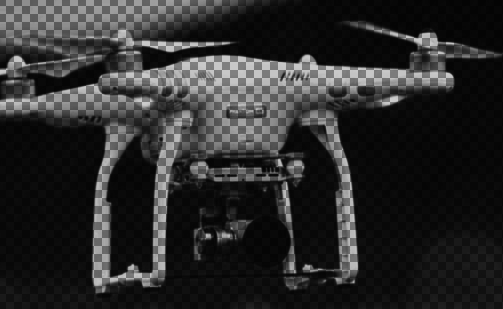

** Raster to svg *******  
** 将图片转换成svg格式 ***   lucas1jorge

Replace "raster.png" on line 8 with the name of your raster image

Set the scale in line 25. Smaller scale means smaller radius of the vector spheres (replacing pixels), and thus leads to better definition:

↓ scale - definition ↑

Raster:

svg:

